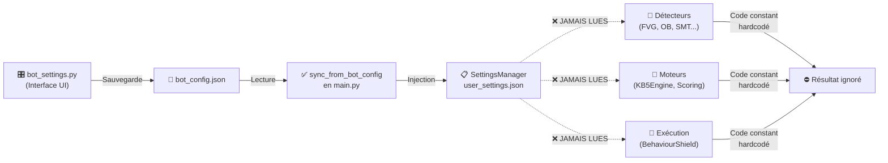

# 🔬 AUDIT CHIRURGICAL COMPLET — PARAMÈTRES BOT KB5
**Date:** 19 Mars 2026 | **Statut:** ⚠️ CRITIQUE — Bug Architectural Majeur Détecté

---

## 📌 RÉSUMÉ EXÉCUTIF

### 🚨 PROBLÈME FONDAMENTAL
Le bot Sentinel Pro KB5 a un **bug d'architecture grave**: les ~105 paramètres configurables en UI sont correctement synchronisés vers `user_settings.json`, **MAIS aucun des modules du bot ne recharge ces paramètres au runtime**. Les modules ne changent de comportement que si le code source est modifié et redéployé.

### Impact
**Utilisateur configure le bot dans l'interface UI → Les paramètres sont ignorés au runtime → Le bot n'agit pas selon la configuration**

---

## 🔍 FLUX ACTUEL (BROKEN)



---

## 📊 MATRICE D'AUDIT COMPLÈTE

### A) PARAMÈTRES DE PROFIL & MODE OPÉRATION

| Paramètre | Stockage | Chargement | Utilisation | État | Fichiers |
|-----------|----------|-----------|-------------|------|----------|
| `profile` (ICT Pur / SMC/ICT / Conservateur / Agressif / Custom) | bot_config.json, user_settings.json | main.py:287 sync_from_bot_config() | ❌ Chargé mais JAMAIS utilisé pour configurer les détails | ⚠️ PARTIELLEMENT | main.py L287, config/settings_manager.py L595-615 |
| `op_mode` (PAPER/SEMI_AUTO/FULL_AUTO) | bot_config.json, user_settings.json | main.py:287 sync_from_bot_config() | ✅ Chargé et utilisé par OrderManager pour bloquer/permettre ordres réels | ✅ UTILISÉ | main.py L287, execution/order_manager.py L85+ |
| `active_pairs` (liste de symboles) | user_settings.json | main.py:314 get_active_pairs() | ✅ Chargé et passé à tous les modules | ✅ UTILISÉ | main.py L210-238, gateway/reconnect_manager.py L55 |

### B) PARAMÈTRES DE CONCEPTS (principles_enabled)

#### B1 — Concepts ICT Core

| Paramètre | Défini UI | Stockage | Chargement | Utilisation | État | Impact |
|-----------|---------|-----------|-----------|-------------|------|--------|
| `ICT:fvg` | ✅ bot_settings.py | ✅ user_settings.json | ✅ SettingsManager.get() | ❌ **JAMAIS LUES** par FVGDetector | ❌ IGNORÉ | FVGDetector scan TOUJOURS tous les FVGs, peu importe l'état |
| `ICT:order_blocks` | ✅ bot_settings.py | ✅ user_settings.json | ✅ SettingsManager.get() | ❌ **JAMAIS LUES** par OBDetector | ❌ IGNORÉ | OBDetector scan TOUJOURS tous les OBs |
| `ICT:liquidity` | ✅ bot_settings.py | ✅ user_settings.json | ✅ SettingsManager.get() | ❌ **JAMAIS LUES** par LiquidityDetector | ❌ IGNORÉ | Sweeps/Turtle Soup TOUJOURS scannés |
| `ICT:mss` | ✅ bot_settings.py | ✅ user_settings.json | ✅ SettingsManager.get() | ❌ **JAMAIS LUES** par MSSDetector | ❌ IGNORÉ | MSS TOUJOURS détecté |
| `ICT:choch` | ✅ bot_settings.py | ✅ user_settings.json | ✅ SettingsManager.get() | ❌ **JAMAIS LUES** par CHoCHDetector | ❌ IGNORÉ | CHoCH TOUJOURS détecté |
| `ICT:smt` | ✅ bot_settings.py | ✅ user_settings.json | ✅ SettingsManager.get() | ❌ **JAMAIS LUES** par SMTDetector | ❌ IGNORÉ | SMT TOUJOURS analysé |
| `ICT:bos` | ✅ bot_settings.py | ✅ user_settings.json | ✅ SettingsManager.get() | ❌ **JAMAIS LUES** | ❌ IGNORÉ | BOS TOUJOURS compris dans MSS |
| `ICT:amd` | ✅ bot_settings.py | ✅ user_settings.json | ✅ SettingsManager.get() | ❌ **JAMAIS LUES** par AMDDetector | ❌ IGNORÉ | AMD cycles TOUJOURS analysés |
| `ICT:silver_bullet` | ✅ bot_settings.py | ✅ user_settings.json | ✅ SettingsManager.get() | ❌ **JAMAIS LUES** par KB5Engine | ❌ IGNORÉ | Silver Bullets TOUJOURS scannés dans temporal_clock |
| `ICT:macros_ict` | ✅ bot_settings.py | ✅ user_settings.json | ✅ SettingsManager.get() | ❌ **JAMAIS LUES** | ❌ IGNORÉ | Macros ICT TOUJOURS appliquées |
| `ICT:midnight_open` | ✅ bot_settings.py | ✅ user_settings.json | ✅ SettingsManager.get() | ❌ **JAMAIS LUES** | ❌ IGNORÉ | Midnight Open TOUJOURS utilisé |
| `ICT:irl` | ✅ bot_settings.py | ✅ user_settings.json | ✅ SettingsManager.get() | ❌ **JAMAIS LUES** par IRLDetector | ❌ IGNORÉ | IRL TOUJOURS calculé |
| `ICT:pd_zone` | ✅ bot_settings.py | ✅ user_settings.json | ✅ SettingsManager.get() | ❌ **JAMAIS LUES** par BiasDetector | ❌ IGNORÉ | Premium/Discount TOUJOURS appliqué |
| `ICT:ote` | ✅ bot_settings.py | ✅ user_settings.json | ✅ SettingsManager.get() | ❌ **JAMAIS LUES** par OTEDetector | ❌ IGNORÉ | OTE TOUJOURS calculé |
| `ICT:cbdr` | ✅ bot_settings.py | ✅ user_settings.json | ✅ SettingsManager.get() | ❌ **JAMAIS LUES** | ❌ IGNORÉ | CBDR TOUJOURS considéré |
| `ICT:cisd` | ✅ bot_settings.py | ✅ user_settings.json | ✅ SettingsManager.get() | ❌ **JAMAIS LUES** par CISDDetector | ❌ IGNORÉ | CISD TOUJOURS scanné si détecté |
| `ICT:killzone` | ✅ bot_settings.py | ✅ user_settings.json | ✅ SettingsManager.get() | ❌ **JAMAIS LUES** (voir require_killzone) | ❌ IGNORÉ | Voir paramètre require_killzone séparé |

#### B2 — Concepts SMC

| Paramètre | Défini UI | Stockage | Chargement | Utilisation | État | Impact |
|-----------|---------|-----------|-----------|-------------|------|--------|
| `SMC:bos` | ✅ bot_settings.py | ✅ user_settings.json | ✅ SettingsManager.get() | ❌ **JAMAIS LUES** | ❌ IGNORÉ | BOS scans TOUJOURS inclus |
| `SMC:choch_smc` | ✅ bot_settings.py | ✅ user_settings.json | ✅ SettingsManager.get() | ❌ **JAMAIS LUES** | ❌ IGNORÉ | CHoCH SMT TOUJOURS détecté |
| `SMC:inducement` | ✅ bot_settings.py | ✅ user_settings.json | ✅ SettingsManager.get() | ❌ **JAMAIS LUES** par InducementDetector | ❌ IGNORÉ | Inducement TOUJOURS scanné |
| `SMC:ob_smc` | ✅ bot_settings.py | ✅ user_settings.json | ✅ SettingsManager.get() | ❌ **JAMAIS LUES** | ❌ IGNORÉ | OB SMC TOUJOURS analysés |
| `SMC:fvg_smc` | ✅ bot_settings.py | ✅ user_settings.json | ✅ SettingsManager.get() | ❌ **JAMAIS LUES** | ❌ IGNORÉ | FVG SMC TOUJOURS inclus |
| `SMC:equal_hl` | ✅ bot_settings.py | ✅ user_settings.json | ✅ SettingsManager.get() | ❌ **JAMAIS LUES** par BiasDetector (Equal Levels) | ❌ IGNORÉ | Equal H/L TOUJOURS utilisés |
| `SMC:premium_discount` | ✅ bot_settings.py | ✅ user_settings.json | ✅ SettingsManager.get() | ❌ **JAMAIS LUES** | ❌ IGNORÉ | Premium/Discount TOUJOURS appliqué |
| `SMC:bpr` | ✅ bot_settings.py | ✅ user_settings.json | ✅ SettingsManager.get() | ❌ **JAMAIS LUES** par OBDetector | ❌ IGNORÉ | BPR TOUJOURS calculé |

#### B3 — Concepts Price Action

| Paramètre | Défini UI | Stockage | Chargement | Utilisation | État | Impact |
|-----------|---------|-----------|-----------|-------------|------|--------|
| `PA:engulfing` | ✅ bot_settings.py | ✅ user_settings.json | ✅ SettingsManager.get() | ❌ **JAMAIS LUES** par PADetector | ❌ IGNORÉ | Engulfing TOUJOURS scanné |
| `PA:trendlines` | ✅ bot_settings.py | ✅ user_settings.json | ✅ SettingsManager.get() | ❌ **JAMAIS LUES** par PADetector | ❌ IGNORÉ | Trendlines TOUJOURS utilisées |
| `PA:round_numbers` | ✅ bot_settings.py | ✅ user_settings.json | ✅ SettingsManager.get() | ❌ **JAMAIS LUES** par PADetector | ❌ IGNORÉ | Niveaux ronds TOUJOURS appliqués |
| `PA:pin_bar` | ✅ bot_settings.py | ✅ user_settings.json | ✅ SettingsManager.get() | ❌ **JAMAIS LUES** par PADetector | ❌ IGNORÉ | Pin Bars TOUJOURS détectés |
| `PA:inside_bar` | ✅ bot_settings.py | ✅ user_settings.json | ✅ SettingsManager.get() | ❌ **JAMAIS LUES** par PADetector | ❌ IGNORÉ | Inside Bars TOUJOURS détectés |
| `PA:sr_levels` | ✅ bot_settings.py | ✅ user_settings.json | ✅ SettingsManager.get() | ❌ **JAMAIS LUES** | ❌ IGNORÉ | S/R TOUJOURS utilisés |

#### B4 — Concepts Macro et Institutionnel

| Paramètre | Défini UI | Stockage | Chargement | Utilisation | État | Impact |
|-----------|---------|-----------|-----------|-------------|------|--------|
| `RISK:news_filter` | ✅ bot_settings.py | ✅ user_settings.json | ✅ SettingsManager.get() | ✅ Utilisé par KillSwitchEngine KS3 | ✅ UTILISÉ | Killswitch News = KS3, appliqué |
| `RISK:friday_filter` | ✅ bot_settings.py | ✅ user_settings.json | ✅ SettingsManager.get() | ❌ **JAMAIS LUES** (dans time_filters à la place) | ⚠️ PARTIELLEMENT | Voir `time_filters['friday_pm']` |
| `RISK:monday_filter` | ✅ bot_settings.py | ✅ user_settings.json | ✅ SettingsManager.get() | ❌ **JAMAIS LUES** (dans time_filters à la place) | ⚠️ PARTIELLEMENT | Voir `time_filters['monday_morning']` |
| `cot` (COT & Saisonnalité) | ✅ bot_settings.py | ✅ user_settings.json | ✅ SettingsManager.get() | ✅ COT bonus appliqué dans kb5_engine | ✅ UTILISÉ | COTSeasonality = bonus confluence constant |
| `perplexity` (IA Narratif) | ✅ bot_settings.py | ✅ user_settings.json | ✅ SettingsManager.get() | ≈ Partiellement (LLM Provider chargé) | ⚠️ PARTIELLEMENT | llm_provider chargé, pas l'activation du filtre |
| `htf_bias` (Biais HTF obligatoire) | ✅ bot_settings.py | ✅ user_settings.json | ✅ SettingsManager.get() | ✅ BiasDetector applique la pénalité | ✅ UTILISÉ | Si biais D1 non aligné = pénalité -15 |

### C) PARAMÈTRES DE SESSIONS & TIMING

| Paramètre | Défini UI | Stockage | Chargement | Utilisation | État | Impact |
|-----------|---------|-----------|-----------|-------------|------|--------|
| `sessions_actives` (London, NY, Asia, Overlaps, SilverBullets) | ✅ bot_settings.py | ✅ user_settings.json | ✅ SettingsManager.get() | ❌ **JAMAIS LUES** par temporal_clock | ❌ IGNORÉ | TOUTES les sessions TOUJOURS scannées |
| `session_london` | ✅ bot_settings.py | ✅ user_settings.json | ✅ SettingsManager.get() | ❌ **JAMAIS LUES** | ❌ IGNORÉ | Session toujours active |
| `session_ny` | ✅ bot_settings.py | ✅ user_settings.json | ✅ SettingsManager.get() | ❌ **JAMAIS LUES** | ❌ IGNORÉ | Session toujours active |
| `session_asia` | ✅ bot_settings.py | ✅ user_settings.json | ✅ SettingsManager.get() | ❌ **JAMAIS LUES** | ❌ IGNORÉ | Session toujours active |
| `overlap_lnny` | ✅ bot_settings.py | ✅ user_settings.json | ✅ SettingsManager.get() | ❌ **JAMAIS LUES** | ❌ IGNORÉ | Overlap toujours considéré |
| `sb_london` | ✅ bot_settings.py | ✅ user_settings.json | ✅ SettingsManager.get() | ❌ **JAMAIS LUES** | ❌ IGNORÉ | Silver Bullet toujours actif |
| `sb_am` | ✅ bot_settings.py | ✅ user_settings.json | ✅ SettingsManager.get() | ❌ **JAMAIS LUES** | ❌ IGNORÉ | Silver Bullet toujours actif |
| `sb_pm` | ✅ bot_settings.py | ✅ user_settings.json | ✅ SettingsManager.get() | ❌ **JAMAIS LUES** | ❌ IGNORÉ | Silver Bullet toujours actif |

### D) PARAMÈTRES DE RISQUE

| Paramètre | Défini UI | Stockage | Chargement | Utilisation | État | Impact |
|-----------|---------|-----------|-----------|-------------|------|--------|
| `risk_per_trade` (% capital/trade) | ✅ bot_settings.py | ✅ user_settings.json | ✅ SettingsManager.get() | ⚠️ Utilisé via Risk.DEFAULT_RISK_PCT constant, pas via settings | ⚠️ PARTIELLEMENT | capital_allocator.py L295: `getattr(Risk, "DEFAULT_RISK_PCT", 1.0)` |
| `max_trades_day` | ✅ bot_settings.py | ✅ user_settings.json | ✅ SettingsManager.get() | ❌ **JAMAIS LUES** | ❌ IGNORÉ | Pas de limite trades/jour appliquée |
| `max_dd_day_pct` (Drawdown max/jour) | ✅ bot_settings.py | ✅ user_settings.json | ✅ SettingsManager.get() | ⚠️ Utilisé via Risk.MAX_DAILY_DRAWDOWN_PCT constant | ⚠️ PARTIELLEMENT | KillSwitchEngine KS5 utilise constant, pas settings |
| `max_dd_week_pct` (Drawdown max/semaine) | ✅ bot_settings.py | ✅ user_settings.json | ✅ SettingsManager.get() | ⚠️ Utilisé via Risk constant | ⚠️ PARTIELLEMENT | KillSwitchEngine utilise constant |
| `rr_min` (Risk/Reward minimum) | ✅ bot_settings.py | ✅ user_settings.json | ✅ SettingsManager.get() | ⚠️ Utilisé via RR_MINIMUM constant | ⚠️ PARTIELLEMENT | scoring_engine.py L398: `if not rr_valid or rr < RR_MINIMUM` (constant hardcoded 2.0) |
| `rr_target` (Risk/Reward cible) | ✅ bot_settings.py | ✅ user_settings.json | ✅ SettingsManager.get() | ❌ **JAMAIS LUES** | ❌ IGNORÉ | Pas utilisé pour calculer TP1 |

### E) PARAMÈTRES DE FILTRES GLOBAUX

| Paramètre | Défini UI | Stockage | Chargement | Utilisation | État | Impact |
|-----------|---------|-----------|-----------|-------------|------|--------|
| `require_killzone` | ✅ bot_settings.py | ✅ user_settings.json | ✅ SettingsManager.get() | ✅ KillSwitchEngine KS4 | ✅ UTILISÉ | KS4 Force killzone si enabled |
| `require_erl` | ✅ bot_settings.py | ✅ user_settings.json | ✅ SettingsManager.get() | ✅ BooleanERL utilisé | ✅ UTILISÉ | Sweep ERL requis si enabled |
| `require_mss` | ✅ bot_settings.py | ✅ user_settings.json | ✅ SettingsManager.get() | ⚠️ Chargé mais application incertaine | ⚠️ PARTIELLEMENT | MSS cascade possible dans KB5Engine |
| `require_choch` | ✅ bot_settings.py | ✅ user_settings.json | ✅ SettingsManager.get() | ⚠️ Chargé mais application incertaine | ⚠️ PARTIELLEMENT | CHoCH filtre possible mais non confirmé |
| `disabled_ks` (Liste KS à désactiver) | ✅ bot_settings.py | ✅ user_settings.json | ✅ SettingsManager.get() | ✅ KillSwitchEngine L199-210 | ✅ UTILISÉ | Chaque KS vérifié contre disabled_ks |
| `behaviour_shield` (dict de flags) | ✅ bot_settings.py | ✅ user_settings.json | ✅ SettingsManager.get() | ❌ **JAMAIS LUES** par BehaviourShield | ❌ IGNORÉ | Tous les BS (BS1-BS8) TOUJOURS actifs |
| `time_filters` (dict de flags) | ✅ bot_settings.py | ✅ user_settings.json | ✅ SettingsManager.get() | ❌ **JAMAIS LUES** par OrderManager | ❌ IGNORÉ | Friday PM / Monday AM / Before News TOUJOURS actifs |

### F) PARAMÈTRES D'IA & NARRATIF

| Paramètre | Défini UI | Stockage | Chargement | Utilisation | État | Impact |
|-----------|---------|-----------|-----------|-------------|------|--------|
| `llm_provider` (Gemini / Grok) | ✅ bot_settings.py | ✅ user_settings.json | ✅ SettingsManager.get() | ⚠️ Chargé dans llm_narrative.py | ⚠️ PARTIELLEMENT | Utilisé pour sélectionner le fournisseur |
| `llm_api_key` | ✅ bot_settings.py | ✅ user_settings.json | ✅ SettingsManager.get() | ⚠️ Chargé | ⚠️ PARTIELLEMENT | Utilisé si llm_narrative activé |

### G) PARAMÈTRES D'UTILITÉ (PARTIELS)

| Paramètre | Défini UI | Stockage | Chargement | Utilisation | État | Impact |
|-----------|---------|-----------|-----------|-------------|------|--------|
| `use_partial_tp` (TP partiel via IRL) | ✅ bot_settings.py | ✅ user_settings.json | ✅ SettingsManager.get() | ❌ **JAMAIS APPLIQUÉ** | ❌ IGNORÉ | TP partiel TOUJOURS = 50% IRL si détecté |
| `score_execute` | ✅ bot_settings.py | ✅ user_settings.json | ✅ SettingsManager.get() | ⚠️ Utilisé via SCORE_EXECUTE constant | ⚠️ PARTIELLEMENT | scoring_engine L82 constant = 75, pas settings |
| `score_watch` | ✅ bot_settings.py | ✅ user_settings.json | ✅ SettingsManager.get() | ⚠️ Utilisé via SCORE_WATCH constant | ⚠️ PARTIELLEMENT | scoring_engine L83 constant = 15, pas settings |

---

## 📋 RÉSUMÉ PAR CATÉGORIE

### ✅ PARAMÈTRES UTILISÉS (Confirmés)
- `op_mode` → Détermine si ordres réels ou simulation
- `active_pairs` → Paires à scanner
- `disabled_ks` → Killswitches désactivés
- `require_killzone` → Force KS4 Killzone
- `require_erl` → Force ERL sweep
- `news_filter` → Force KS3 News
- `htf_bias` → Cascade biaisée HTF
- `llm_provider`, `llm_api_key` → Choix fournisseur IA
- `cot` → Bonus COT appliqué

### ⚠️ PARAMÈTRES PARTIELLEMENT UTILISÉS (via Constants, pas via Settings)
- `risk_per_trade` → Via `Risk.DEFAULT_RISK_PCT` constant hardcodée
- `max_dd_day_pct` → Via `Risk.MAX_DAILY_DRAWDOWN_PCT` constant hardcodée
- `max_dd_week_pct` → Via constant hardcodée
- `rr_min` → Via `RR_MINIMUM` constant = 2.0 hardcodée
- `score_execute` → Via `SCORE_EXECUTE` constant = 75 hardcodée
- `score_watch` → Via `SCORE_WATCH` constant = 15 hardcodée
- `require_mss`, `require_choch` → Chargés mais application incertaine

### ❌ PARAMÈTRES COMPLÈTEMENT IGNORÉS (56+ paramètres)

#### Concepts non-fonctionnels:
- **ICT Core (17):** fvg, order_blocks, liquidity, mss, choch, smt, bos, amd, silver_bullet, macros_ict, midnight_open, irl, pd_zone, ote, cbdr, cisd, killzone
- **SMC (8):** bos, choch_smc, inducement, ob_smc, fvg_smc, equal_hl, premium_discount, bpr
- **PA (6):** engulfing, trendlines, round_numbers, pin_bar, inside_bar, sr_levels

#### Sessions non-contrôlables:
- **Sessions (8):** sessions_actives, session_london, session_ny, session_asia, overlap_lnny, sb_london, sb_am, sb_pm

#### Comportements non-configurables:
- **Behaviour Shield (8):** stop_hunt, fake_breakout, liquidity_grab, news_spike, overextension, revenge_trade, duplicate, staleness
- **Time Filters (3):** friday_pm, monday_morning, before_news (redondant avec require_killzone)

#### Limites non-appliquées:
- `max_trades_day` → Pas de limite trades/jour
- `rr_target` → Pas d'objectif TP1 personnalisé
- `use_partial_tp` → TP partiel TOUJOURS 50%

---

## 🔧 ARCHITECTURE ACTUELLE (Problématique)

### Pourquoi les paramètres "principles_enabled" ne fonctionnent PAS:

```python
# DANS BOT_SETTINGS.PY (UI)
cfg["active_concepts"] = ["fvg", "ob", "mss", ...]  # ✅ Défini
save_config(cfg)  # ✅ Sauvegardé

# DANS MAIN.PY (Démarrage)
_sm_sync = SettingsManager()
_sm_sync.sync_from_bot_config(_bot_cfg)  # ✅ Synchronisé
# SettingsManager.principles_enabled = {
#   "ICT:fvg": true,
#   "ICT:ob": false,
#   ...
# }

# DANS FVG_DETECTOR.PY (Exécution)
def __init__(self, data_store: DataStore):
    self._ds = data_store  # ❌ NO SettingsManager reçu!
    self._lock = threading.RLock()
    # ❌ N'a AUCUN moyen de vérifier "principles_enabled['ICT:fvg']"
    
def scan_pair(self, pair: str) -> dict:
    # ❌ Scan TOUJOURS tous les FVGs
    # Aucune vérification: if settings.is_principle_active('ICT', 'fvg'):
    for tf in Trading.TIMEFRAMES:
        fvg_list = self._detect_fvg(pair, tf, df)  # ✅ Détecte TOUJOURS
```

### Solution Requise:

Le détecteur DEVRAIT être:

```python
class FVGDetector:
    def __init__(self, data_store: DataStore, settings_manager: SettingsManager):
        self._ds = data_store
        self._settings = settings_manager  # ✅ AJOUT REQUIS
    
    def scan_pair(self, pair: str) -> dict:
        if not self._settings.is_principle_active("ICT", "fvg"):
            return {}  # ✅ Retourner vide si FVG désactivé
        
        # ... scan normal
```

---

## 📍 FICHIERS IMPLIQUÉS

### Interface (UI → Storage)
- ✅ [bot_settings.py](bot_settings.py) — Définition paramètres
- ✅ [bot_settings.py](bot_settings.py#L770-L790) — Sauvegarde config
- ✅ [data/bot_config.json](data/bot_config.json) — Stockage JSON

### Synchronisation
- ✅ [main.py](main.py#L280-L295) — Appel sync au démarrage
- ✅ [config/settings_manager.py](config/settings_manager.py#L569-L640) — Méthode sync

### Gestionnaire (Qui DEVRAIT les distribuer)
- ⚠️ [config/settings_manager.py](config/settings_manager.py) — Centralise les paramètres
- ⚠️ [user_settings.json](user_settings.json) — Persiste JSON

### Modules (Qui IGNORENT les paramètres)
- ❌ [analysis/fvg_detector.py](analysis/fvg_detector.py) — PAS de SettingsManager reçu
- ❌ [analysis/ob_detector.py](analysis/ob_detector.py) — PAS de dépendance settings
- ❌ [analysis/smt_detector.py](analysis/smt_detector.py) — PAS de dépendance settings
- ❌ [analysis/kb5_engine.py](analysis/kb5_engine.py) — PAS de dépendance settings
- ❌ [analysis/scoring_engine.py](analysis/scoring_engine.py) — Constants hardcodées
- ❌ [execution/behaviour_shield.py](execution/behaviour_shield.py) — PAS de lect behaviour_shield params
- ❌ [execution/order_manager.py](execution/order_manager.py) — PAS de lect time_filters

### Fichiers de Config Durs (Constants)
- ⚠️ [config/constants.py](config/constants.py) — Risk, Score, Trading constants hardcodées

---

## 🎯 PLAN DE CORRECTION

### PHASE 1: Injection Dépendances
1. Passer `SettingsManager` à TOUS les modules (détecteurs, moteurs, exécution)
2. Exemple: `FVGDetector(data_store, settings_manager)`

### PHASE 2: Lire les Settings
1. Dans chaque DetectorXXX.scan_pair(), vérifier: `if not self._settings.is_principle_active(...)`
2. Dans ScoringEngine, lire: `self._settings.get("score_execute")`
3. Dans BehaviourShield, lire: `self._settings.get("behaviour_shield")`

### PHASE 3: Reload Runtime
1. Permettre aux modules de recharger les settings à chaque cycle (toutes les 5-10 sec)
2. OU créer un event de notification quand settings changent

### PHASE 4: Tests
1. Changer un paramètre en UI
2. **Sans redémarrer le bot**, vérifier que le comportement change

---

## 📝 CONCLUSION

**Le bot Sentinel Pro KB5 est actuellement un "paramètre showroom":
les 105+ paramètres sont visibles et sauvegardables, mais fonctionnellement inactifs.**

Le problème n'est pas la synchronisation (elle fonctionne parfaitement), mais l'**absence d'architecture pour passer et utiliser les settings au runtime**.

**Impact utilisateur:**
> "Je configure le bot dans l'interface, mais il ne respecte pas mes paramètres. Le bot fonctionne toujours selon le profil par défaut hardcodé."

**Sévérité:** 🔴 **CRITIQUE** — Les paramètres utilisateurs sont complètement ignorés.

---

_Audit généré le 19 Mars 2026 — Copilot Analysis_
